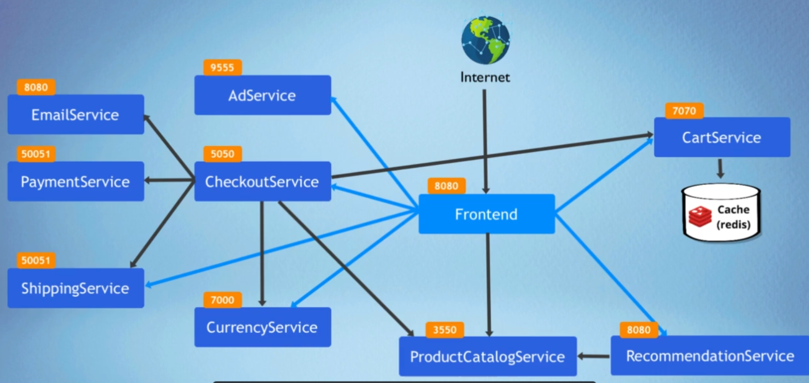
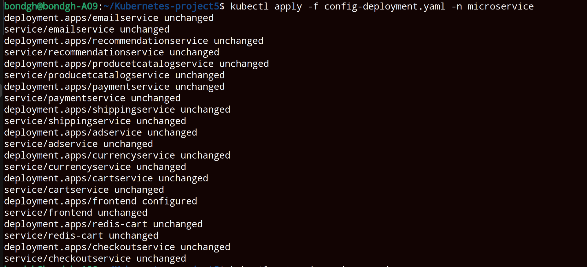
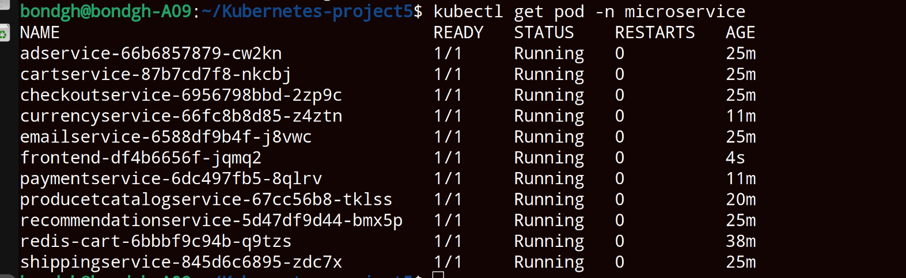

<h1>Kubernetes Demo Project5</h1>
<h2>Technologies used</h2>

- <b>Kubernetes</b> 
- <b>Redis</b>
- <b>Linux</b>
- <b>Linode LKE</b>

<h2>Detailed Description of Project </h2>
1. Create K8s minifests for Deployments and Services for all microservices of an online shop application  
2. Deploy microservices to linode managed kubernetes cluster 

   

   <h2>step1</h2>
   Key information before deploying microservice application 
   1. How the services are connected 
   2. If the application requires any third party service eg databases 
   3. Which Service is accessible from outside the cluster 
   4. The image name for each microservice 
   5. Environment vaiable required for each microservice 
   6. Ports on which each microservice starts 
   7. Namespace in which microservice is deployed 

   From the above information, a connection graph is generated 
   

   <h2>step2</h2>
   Create a kubernetes cluster in linode 
   change permission on kubeconfig.yaml file 
   connect to the cluster 
   
  
  
  

   <h2>step3</h2>
 
  Create Deployment and Service for all microServices in the created cluster
   
   

 <h2>step4</h2>
 All pod are running and application can be accessed in the browser using the node IP and  
 configured external service IP with the frontend service 
 
     

